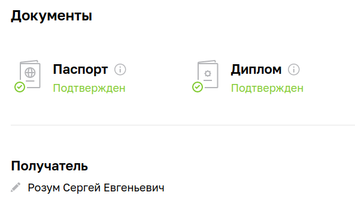

# Задание

Преподаватель: Роман Алексеев

Рады приветствовать на дипломном модуле.

Чтобы получить доступ к дипломному заданию и курсу «Антология трудоустройства» от Центра развития карьеры Нетологии, ответьте, пожалуйста, на несколько вопросов. Это поможет нам организовать выдачу диплома о профпереподготовке после завершения обучения.

## Вопросы

1. Получилось ли у вас загрузить в личный кабинет документы, подтверждающие личность, и диплом о высшем или среднем специальном образовании?

    Да.
    Пожалуйста, пришлите скриншот личного кабинета в виде ссылки.
    
    
  
2. Нужна ли вам справка об обучении после сдачи диплома? Она выдаётся всем студентам, в том числе тем, у кого нет диплома о высшем или среднем специальном образовании.

   Нет.

3. Удалось ли вам сдать минимум 80% домашних заданий на каждом модуле профессии?

    Да.
  
